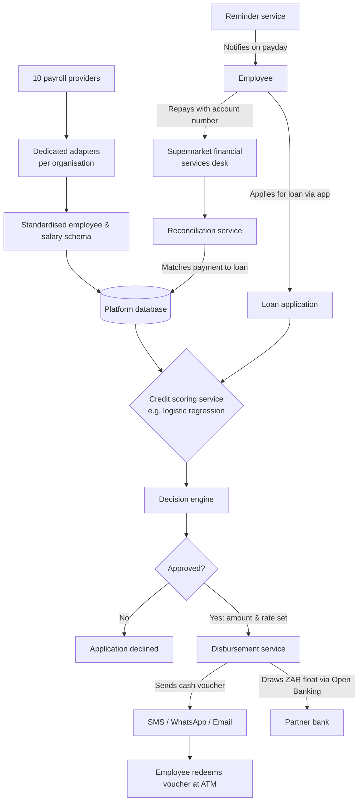

# Brief overview: The payday lending platform (us) gets payroll data from 10 different providers and ingests them using our platform that standises all of the data from the platforms -> allows requests of platform users to get a loan -> checks whether they qualify for the loan 

# numbered workflow 

1. Each organisation's payroll system is read by a dedicated adapter, which converts the data into a common employee and salary schema and stores it in the platform database.
2. An employee applies for a loan through the app.
3. The credit scoring service (for example a logistic regression model) uses the normalised payroll history to produce a score, and the decision engine turns that into an approved amount and interest rate.
4. The disbursement service draws on the ZAR float at the partner bank via Open Banking and sends the employee a cash voucher by SMS, WhatsApp or email, which they redeem at an ATM.
5. On payday the reminder service notifies the employee. They repay at a supermarket financial services desk using their account number, and the reconciliation service matches the payment to the loan.

# diagram 

