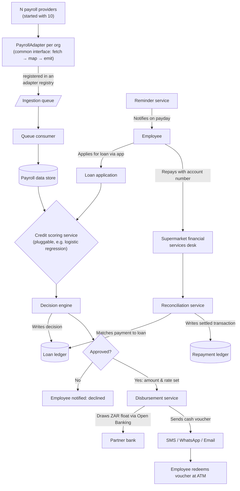

# Brief overview

The payday lending platform (us) ingests payroll data from N different organisations (starting with 10), each running a different payroll system. A common `PayrollAdapter` interface and an adapter registry mean onboarding a new organisation only requires implementing that interface and registering it — the core platform never changes, which is what makes the system scale to an arbitrary number of organisations. Ingested data is standardised and queued so ingestion volume/cadence per organisation doesn't bottleneck the core platform. Employees of onboarded organisations can then request a loan; a pluggable credit scoring service and decision engine check eligibility, size, and pricing; approved loans are disbursed as redeemable cash vouchers; and repayments are collected and reconciled against the loan ledger.

# numbered workflow

1. Each organisation's payroll system is read by a dedicated adapter (implementing a shared `PayrollAdapter` interface: fetch → map to common schema → emit). New organisations are onboarded by adding a config entry + adapter implementation to a registry — no changes to core services required, which is what lets the platform scale to an unbounded number of payroll systems.
2. Adapters publish standardised employee/salary events onto an ingestion queue rather than writing directly to the database. This decouples each organisation's ingestion cadence (daily, weekly, real-time) from the platform, and lets ingestion workers scale independently as more organisations are added.
3. A queue consumer writes the standardised records into the **payroll data store** (kept separate from loan and repayment data so each store can scale/version independently).
4. An employee applies for a loan through the app.
5. The credit scoring service — a pluggable component exposing a simple "features in, score out" interface (e.g. logistic regression today, swappable for a neural network later without touching the decision engine) — reads normalised payroll history from the payroll data store and produces a score.
6. The decision engine turns that score into an approved amount and interest rate, and records the decision in the **loan ledger** (separate from payroll data).
7. If declined, the employee is notified in-app and the flow ends.
8. If approved, the disbursement service draws on the ZAR float held at the partner bank via Open Banking and sends the employee a cash voucher by SMS, WhatsApp or email, which they redeem for cash at an ATM.
9. On payday, the reminder service notifies the employee to repay.
10. The employee repays at a supermarket financial services desk using their account number as reference.
11. The reconciliation service matches the incoming payment to the correct loan in the loan ledger and updates its status, writing the settled transaction to the **repayment ledger**.

# diagram

